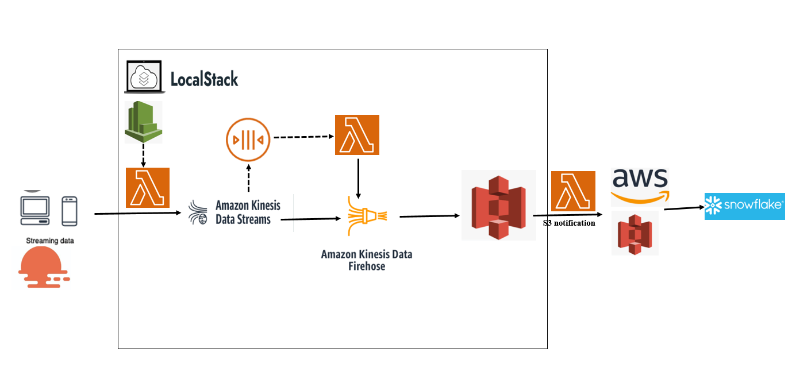
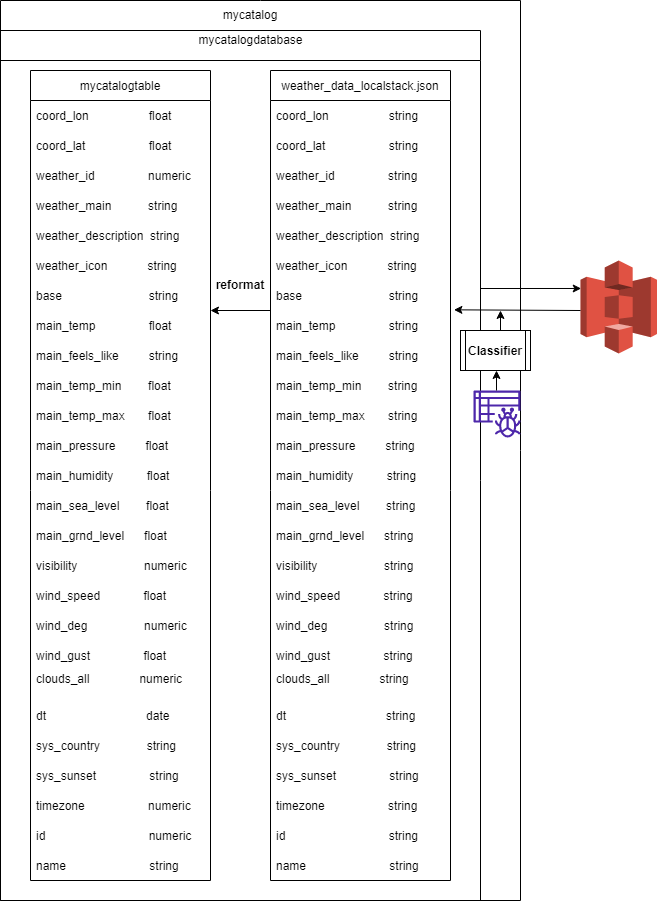
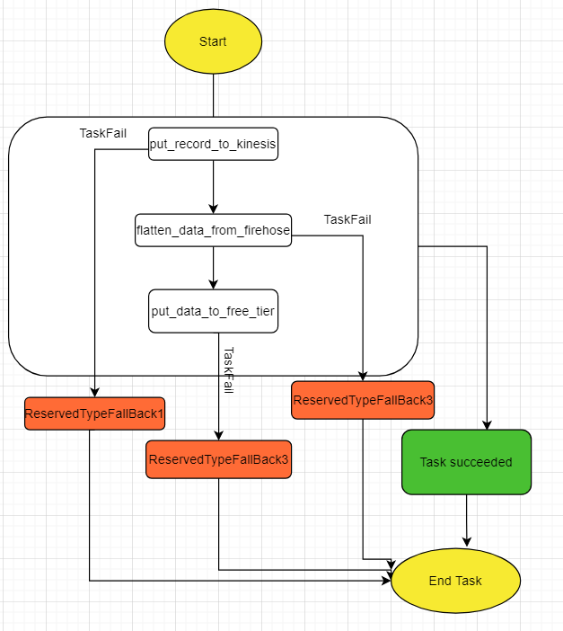

## I. Kinesis stream and Kinesis firehose

1. Definition and workflow

- Amazon Kinesis Data Streams to collect and process large streams of data records in real time.
- A typical Kinesis Data Streams application reads data from a data stream as data records. These applications can use the Kinesis Client Library
- Kinesis Data Streams is part of the Kinesis streaming data platform, along with Kinesis Data Firehose, Kinesis Video Streams, and Kinesis Data Analytics.

- To put data into the stream, you must specify the name of the stream, a partition key, and the data blob to be added to the stream. The partition key is used to determine which shard in the stream the data record is added to.
- All the data in the shard is sent to the same worker that is processing the shard. Which partition key you use depends on your application logic. The number of partition keys should typically be much greater than the number of shards. This is because the partition key is used to determine how to map a data record to a particular shard. If you have enough partition keys, the data can be evenly distributed across the shards in a stream.

_Source: https://docs.aws.amazon.com/streams/latest/dev/building-producers.html_

_Source: https://docs.aws.amazon.com/streams/latest/dev/writing-with-agents.html_

- **There are two types of services in AWS Kinesis** : Producers contribute data records to the stream. Consumers receive and process those data records
- **Kinesis Data Streams Limits** : Kinesis Data Stream has its limits. It can write 1000 records per second. It can write 1 MB per second. It can read up to 10000 records per second. It can read up to 2 MB per second.
- **Kinesis shard** : A shard has a sequence of data records in a stream. It serves as a base throughput unit of a Kinesis data stream. A shard supports 1 MB/second and 1,000 records per second for writes and 2 MB/second for reads. A producer puts data records into shards and a consumer gets data records from shards.
- **Record** : A record is the unit of data stored in an Amazon Kinesis data stream. A record is composed of a sequence number, partition key, and data blob. Data blob is the data of interest your data producer adds to a data stream. The maximum size of a data blob (the data payload before Base64-encoding) is 1 megabyte (MB).
- **Partition key :** A partition key is used to segregate and route records to different shards of a data stream. A partition key is specified by your data producer while adding data to a Kinesis data stream. For example, let&#39;s say you have a data stream with two shards (shard 1 and shard 2). You can configure your data producer to use two partition keys (key A and key B) so that all records with key A are added to shard 1 and all records with key B are added to shard 2.
- **Sequence number:** A sequence number is a unique identifier for each record. Sequence number is assigned by Amazon Kinesis when a data producer calls PutRecord or PutRecords operation to add data to a Amazon Kinesis data stream. Sequence numbers for the same partition key generally increase over time; the longer the time period between PutRecord or PutRecords requests, the larger the sequence numbers become.
- **Kinesis firehose** : Buffer incoming data to the specified size, in MBs, before delivering it to the destination. The default value is 5. We recommend setting SizeInMBs to a value greater than the amount of data you typically ingest into the delivery stream in 10 seconds. For example, if you typically ingest data at 1 MB/sec set SizeInMBs to be 10 MB or higher.

### Practice

- _Step 1_: create kinesis stream by terraform

check: aws kinesis describe-stream --stream-name terraform-kinesis-test --endpoint-url [http://localhost:4566](http://localhost:4566/)

- _Step 2_: create lamdba function to add data to kinesis stream

- _Step 3_: add lambda function to terraform file
- _Step 4_: terraform init, terraform apply

check lambda: aws lambda invoke --function-name put\_record --endpoint-url [http://localhost:4566](http://localhost:4566/) put\_record.txt

- _Step 5_: create lambda triggered by Cloudwatch (5 minutes per time)
- _Step 6_: check stream and trigger in docker container
- _Step 7_: create lambda to get record, flatten data

check lambda: aws lambda invoke --function-name flatten\_data --endpoint-url http://localhost:4566 flatten\_data.txt

## II. Glue table catalog

The AWS Glue Data Catalog is your persistent metadata store that keeps references to your source and target data. AWS Glue Data Catalog uses metadata tables to store your data. It is a managed service that lets you store, annotate, and share metadata in the AWS Cloud. With AWS Glue, you store metadata in the AWS Glue Data Catalog. You use this metadata to orchestrate ETL jobs that transform data sources and load your data warehouse or data lake.

To define Data Catalog objects such as databases, tables, partitions, crawlers, classifiers and connections, you can use AWS CloudFormation templates that are compatible with AWS Glue. The Data Catalog can also keep resource links to local or shared databases and table resource links. You can use these resource links in cases where you use database names.

- AWS classifier: A classifier reads the data in a data store. If it recognizes the format of the data, it generates a schema. The classifier also returns a certainty number to indicate how certain the format recognition was.

_Source: https://docs.aws.amazon.com/glue/latest/dg/add-classifier.html_

_Source:_ [_https://docs.aws.amazon.com/glue/latest/dg/getting-started.html_](https://docs.aws.amazon.com/glue/latest/dg/getting-started.html)

_Source:_ [_https://docs.aws.amazon.com/glue/latest/dg/crawler-running.html_](https://docs.aws.amazon.com/glue/latest/dg/crawler-running.html)

## III. Step function

### Definition

Step Functions is a serverless orchestration service that lets you combine AWS Lambda functions and other AWS services to build business-critical applications. Through Step Functions&#39; graphical console, you see your application&#39;s workflow as a series of event-driven steps. Step Functions is based on state machines and tasks. A state machine is a workflow. A task is a state in a workflow that represents a single unit of work that another AWS service performs.

Step Functions has two workflow types. Standard workflows have exactly-once workflow execution and can run for up to one year. Express workflows have at-least-once workflow execution and can run for up to five minutes.

### Practice

- _Step 1_: set up role and policy for state machine and rights for accessing lambda function
- _Step 2_: Create an error lambda to check workflow
- _Step 3_: set up step function for error handling by terraform

Check: aws stepfunctions --endpoint http://localhost:4566 describe-state-machine --state-machine-arn arn:aws:states:us-east-1:000000000000:stateMachine:stateMachine

- _Step 4_: execute state machine

Command: aws stepfunctions start-execution --state-machine-arn arn:aws:states:us-east-1:000000000000:stateMachine:stateMachine --endpoint-url http://localhost:4566

check: aws stepfunctions list-executions --state-machine-arn arn:aws:states:us-east-1:000000000000:stateMachine:stateMachine --endpoint-url http://localhost:4566

Result: {

&quot;executionArn&quot;:

&quot;arn:aws:states:us-east-1:000000000000:execution:stateMachine:3d0c0d00-7245-43d8-8c12-4dbdea88156a&quot;,

&quot;startDate&quot;: &quot;2022-05-03T11:54:14.974000+07:00&quot;

}

check: aws stepfunctions describe-execution --execution-arn arn:aws:states:us-east-1:000000000000:execution:stateMachine:3d0c0d00-7245-43d8-8c12-4dbdea88156a

--endpoint-url http://localhost:4566

Result:{

&quot;executionArn&quot;:

&quot;arn:aws:states:us-east-1:000000000000:execution:stateMachine:3d0c0d00-7245-43d8-8c12-4dbdea88156a&quot;,

&quot;stateMachineArn&quot;:

&quot;arn:aws:states:us-east-1:000000000000:stateMachine:stateMachine&quot;,

&quot;name&quot;: &quot;3d0c0d00-7245-43d8-8c12-4dbdea88156a&quot;,

&quot;status&quot;: &quot;RUNNING&quot;,

&quot;startDate&quot;: &quot;2022-05-03T11:54:14.974000+07:00&quot;,

&quot;input&quot;: &quot;{}&quot;,

&quot;inputDetails&quot;: {

&quot;included&quot;: true

}

}

- _Step 5_: Check docker UI. Workflow will stop after an error is set in state machine
## IV. Demo Video Sprint 2

