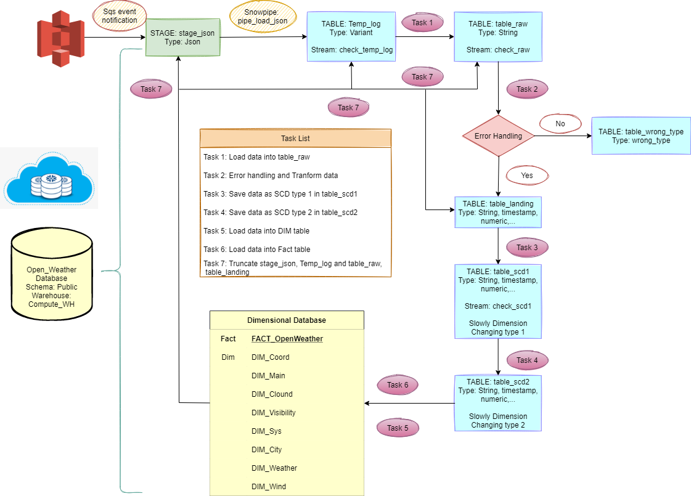
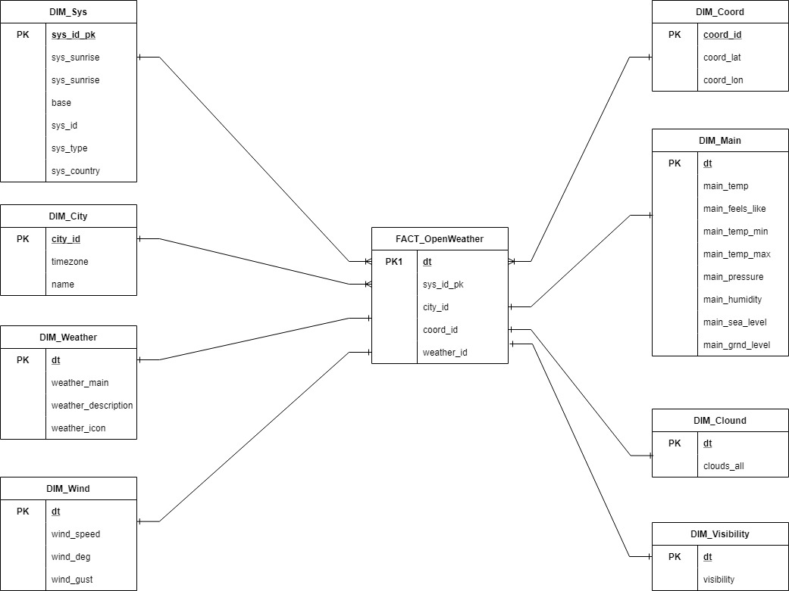
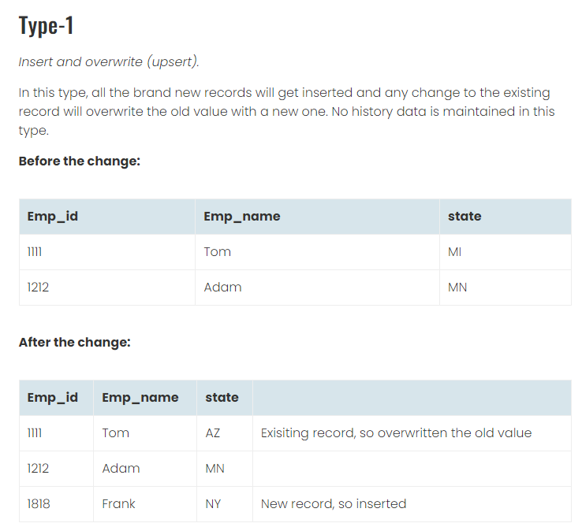
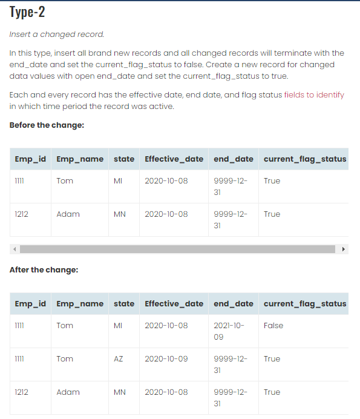

# SNOWFLAKE RUNBOOK

### 1. Project Main Workflow

- Connect Snowflake and S3 though **Snowflake Intergration** and **AWS S3**.

- Create Database, Schema, Warehouse for Project.

- Access Control for **system_admin**, **analyst** and **intern** role.

- Load data from S3 into snowflake using snowpipe. 

- Stream and task for automate data pipeline.



### 2. Snowflake and S3 connection

#### 2.1. Snowflake Intergration
```
--connect to s3
CREATE OR REPLACE STORAGE INTEGRATION snowflake_aws
TYPE = EXTERNAL_STAGE
STORAGE_PROVIDER = S3
ENABLED = TRUE
STORAGE_AWS_ROLE_ARN = 'arn:aws:iam::048115563449:role/mysnowflakerole'
STORAGE_ALLOWED_LOCATIONS = ('s3://snowflake112358');

DESC INTEGRATION snowflake_aws;
```
#### 2.2. IAM Role and IAM Policy

- Create **mysnowflakerole** with policy template as below

```
{
    "Version": "2012-10-17",
    "Statement": [
        {
            "Effect": "Allow",
            "Action": [
                "s3:GetObject",
                "s3:GetObjectVersion",
                "s3:DeleteObject",
                "s3:PutObject"
            ],
            "Resource": "arn:aws:s3:::<your-bucket>/*"
        },
        {
            "Effect": "Allow",
            "Action": [
                "s3:ListBucket",
                "s3:GetBucketLocation"
            ],
            "Resource": "arn:aws:s3:::<your-bucket>"
        }
    ]
}
```
### 3. Access Control
- Create **system_admin**, **analyst** and **intern** role as below 
```
use role accountadmin;

-- Create new role
drop role if exists intern;
drop role if exists analyst;
drop role if exists system_admin;
create role intern;
create role analyst;
create or replace role system_admin;

-- Grant read-only permissions on database PRACTICE to intern role.
grant usage on database OPEN_WEATHER to role intern;
grant usage on all schemas in database OPEN_WEATHER to role intern;
grant select on all tables in database OPEN_WEATHER to role intern;

-- Grant read-write permissions on database PRACTICE to intern role.
grant usage on database PRACTICE to role intern;
grant usage on all schemas in database PRACTICE to role intern;
grant select,insert,update,delete on all tables in database PRACTICE to role intern;

-- Grant read-write permissions on database OPEN_WEATHER to analyst role.
grant usage on database OPEN_WEATHER to role analyst;
grant usage on all schemas in database OPEN_WEATHER to role analyst;
grant select,insert,update,delete on all tables in database OPEN_WEATHER to role analyst;
-- Grant warehouse usage on 
grant operate on warehouse COMPUTE_WH to role analyst;

-- Grant read-write permissions on database OPEN_WEATHER to analyst role.
grant usage on database PRACTICE to role analyst;
grant usage on all schemas in database PRACTICE to role analyst;
grant select,insert,update,delete on all tables in database PRACTICE to role analyst;

--sysadmin has all permissions that intern and analyst role has
grant role intern,analyst to role system_admin;

grant role intern to user QUANVM4;
grant role analyst to user QUANVM4;
grant role system_admin to user QUANVM4;

show grants to role intern;
show grants to role analyst;
show grants to role system_admin;
```
### 5. Database Schema

- Use create table 
```
create or replace table temp_log 
(
  logcontent VARIANT
);
```
- For more information please read **DB_Schema.txt**
### 4. Load data from S3 into snowflake using snowpipe
#### 4.1. Create json file format
```
create or replace file format json_format 
    type = json;
```
#### 4.2. Create stage for snowpipe to load data
```
create or replace stage stage_json
  url = 's3://snowflake112358'
  storage_integration = snowflake_aws;
```
#### 4.3. Create stage for snowpipe to load data
```
--CREATE SNOWPIPE TO LOAD DATA FROM S3 BUCKET <SNOWFLAKE112358>
create or replace pipe open_weather.public.pipe_load_json
    auto_ingest=true as
      copy into temp_log
      from @stage_json
        file_format = (format_name = json_format);
```
### 5. Stream and task for automate data pipeline.
#### 5.1. Create stream
```
--CREATE STREAM 
create or replace stream check_temp_log on table temp_log;
create or replace stream check_raw on table table_raw;
create or replace stream check_scd1 on table table_scd1;
```
#### 5.2. Create tasks 
- Tasks is use for **automate data pipeline**, **Auto Error Handling**. 
- For more information please read **Main.txt**
```
create or replace task task1_root_Loadinto_RawTable
    warehouse = compute_wh 
    schedule = '1 minute'
when
  system$stream_has_data('check_temp_log')
as
<do something>
```
### 6. Slowly changing dimensions
#### 6.1. Slowly changing dimensions 1
- Example 1: 

#### 6.2. Slowly changing dimensions 2
- Example 2: 


### 7. Auto Suspend Setting Optimization
- Set up Warehouse workloads and automating changes to the Auto Suspend settings. Depending on the workloads can automate additional cost savings with this automation. 
```
CREATE WAREHOUSE "compute_wh"
  WITH WAREHOUSE_SIZE = 'XSMALL'
    WAREHOUSE_TYPE = 'STANDARD'
    AUTO_SUSPEND = 600
    AUTO_RESUME = TRUE;
```

### 8. Snowflake Demo Video 


